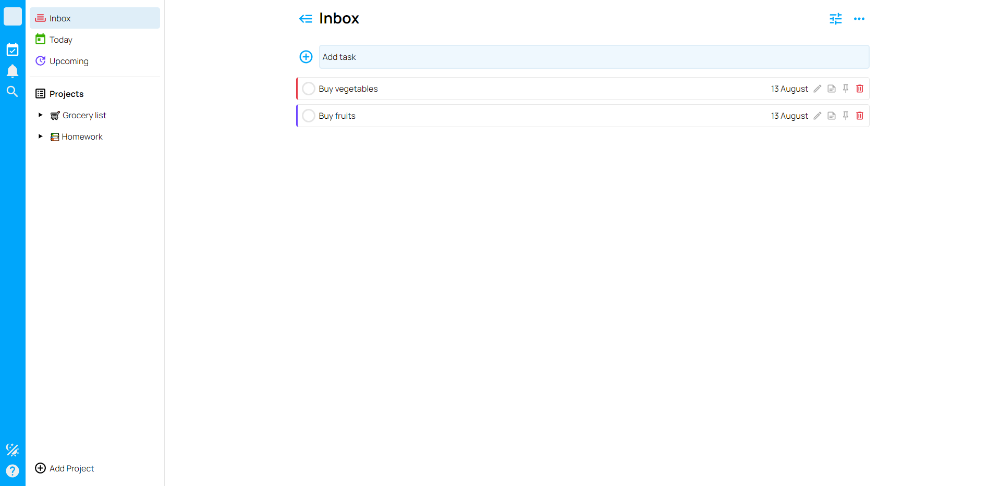

# Todo App

This project is a part of the "The Odin Project" [curriculum](https://www.theodinproject.com/).

## Table of contents

- [Overview](#overview)
  - [Screenshot](#screenshot)
  - [Links](#links)
- [My process](#my-process)
  - [Built with](#built-with)

## Overview

### Screenshot

### Links

- Repository URL: [View Code](https://github.com/romaleks/Todo-List)
- Live Site URL: [Live Preview](https://romaleks.github.io/Todo-List/)

## My process

### Built with

- ES6 Modules
- OOP Principles
- LocalStorage API
- JSON
- Date-fns Library
- Sass
- Webpack
- Visual Studio Code
